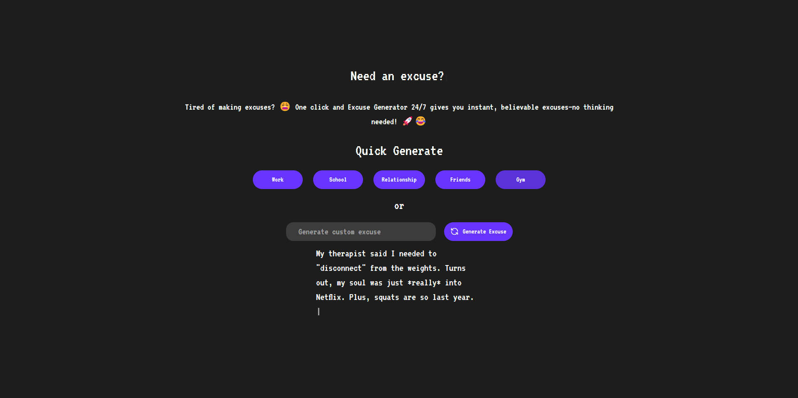
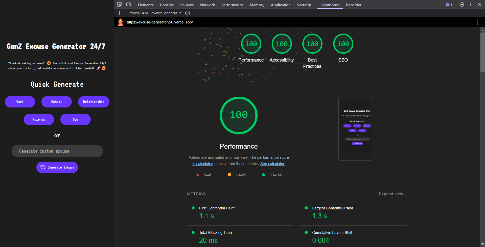

# Excuse Generator 2.0 🚀

## 🌟 Overview

Excuse Generator 2.0 is a powerful Next.js-based web application that generates creative and hilarious excuses using AI. Whether you need an excuse for work, school, or any situation, this tool provides instant, witty responses powered by an AI API. Built for speed, usability, and SEO optimization, it ensures high engagement and discoverability. 🔥

## 🎯 Features

-  🔥 **AI-Powered Excuse Generation** - Get unique and intelligent excuses on the fly.
-  ⚡ **Blazing Fast** - Built with Next.js for instant performance.
-  🎨 **Responsive UI** - Fully optimized for mobile and desktop users.
-  🌐 **SEO Optimized** - Designed to rank high with perfect SEO implementation.
-  📌 **Dark Mode Support** - Eye-friendly interface

## 🛠️ Tech Stack

-  **Frontend:** Next.js, React, Tailwind CSS
-  **Backend:** AI API (Gemini API)
-  **Deployment:** Vercel

## 🚀 Getting Started

### 📌 Prerequisites

-  Node.js (v16+ recommended)
-  npm or yarn

### 🔧 Installation

```sh
# Clone the repository
git clone https://github.com/BimeshW/Excuse-generator2.0.git
cd Excuse-generator2.0

# Install dependencies
npm install  # or yarn install
```

### 🚀 Running Locally

```sh
# Start the development server
npm run dev  # or yarn dev
```

Visit `http://localhost:3000` to use the application.

## 🖼️ Screenshots & Demo

### 📸 App Screenshots


_Add more screenshots here_

### 🌍 SEO Preview Image



## 📌 SEO Optimization

-  ✅ **Perfect Meta Tags** for Google ranking.
-  ✅ **Alt Text on Images** for better indexing.
-  ✅ **Mobile Optimization** to enhance user experience.
-  ✅ **Fast Load Times** due to Next.js and efficient asset handling.
-  ✅ **Keyword-Rich Content** to improve discoverability.

## 🤝 Contributing

Contributions are welcome! Feel free to fork the repo, submit issues, and open PRs.

🚀 **Excuse Generator 2.0 – The best excuse-making tool on the web!** 🔥
